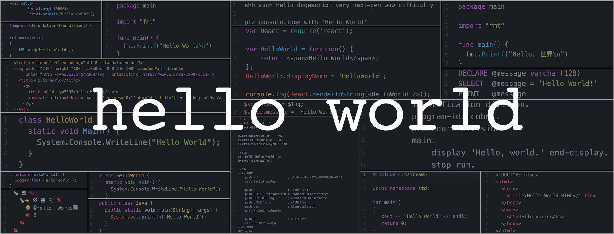
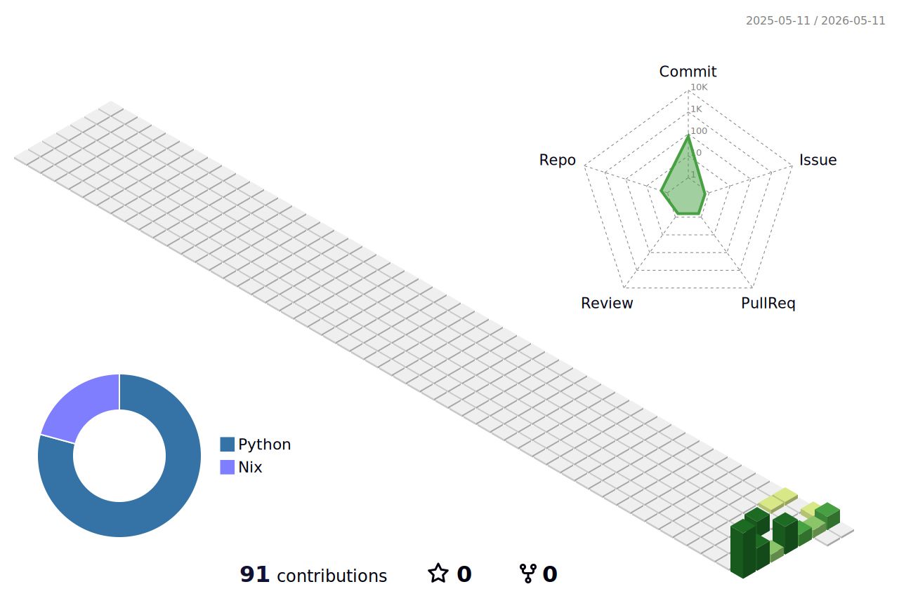
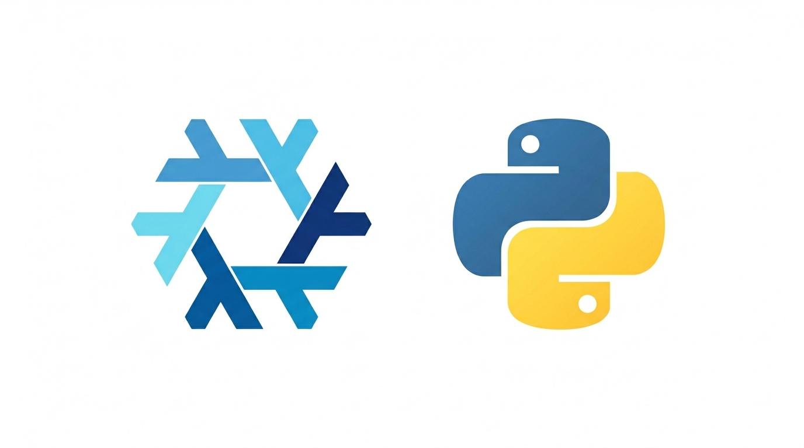

<picture>
    <source media="(prefers-color-scheme: dark)"  srcset="header-dark.jpg">
    <source media="(prefers-color-scheme: light)" srcset="header-light.jpg">
    
</picture>

<h1>I'm Johnathan Radojevich 👋 I love to code. I love creating impact.</h1>
<picture>
    <source media="(prefers-color-scheme: light)" srcset="https://img.shields.io/badge/-HTML-000000?style=flat-square&logo=htmx">
    <source media="(prefers-color-scheme: dark)" srcset="https://img.shields.io/badge/-HTML-0e1117?style=flat-square&logo=htmx">
    
</picture>
<picture>
    <source media="(prefers-color-scheme: light)" srcset="https://img.shields.io/badge/-CSS-000000?style=flat-square&logo=css">
    <source media="(prefers-color-scheme: dark)" srcset="https://img.shields.io/badge/-CSS-0e1117?style=flat-square&logo=css">
    
</picture>
<picture>
    <source media="(prefers-color-scheme: light)" srcset="https://img.shields.io/badge/-JavaScript-000000?style=flat-square&logo=javascript">
    <source media="(prefers-color-scheme: dark)" srcset="https://img.shields.io/badge/-JavaScript-0e1117?style=flat-square&logo=javascript">
    
</picture>
<picture>
    <source media="(prefers-color-scheme: light)" srcset="https://img.shields.io/badge/-TypeScript-000000?style=flat-square&logo=typescript">
    <source media="(prefers-color-scheme: dark)" srcset="https://img.shields.io/badge/-TypeScript-0e1117?style=flat-square&logo=typescript">
    
</picture>
<picture>
    <source media="(prefers-color-scheme: light)" srcset="https://img.shields.io/badge/-Java-000000?style=flat-square&logo=coffeescript">
    <source media="(prefers-color-scheme: dark)" srcset="https://img.shields.io/badge/-Java-0e1117?style=flat-square&logo=coffeescript">
    
</picture>
<picture>
    <source media="(prefers-color-scheme: light)" srcset="https://img.shields.io/badge/-Golang-000000?style=flat-square&logo=go">
    <source media="(prefers-color-scheme: dark)" srcset="https://img.shields.io/badge/-Golang-0e1117?style=flat-square&logo=go">
    
</picture>
<picture>
    <source media="(prefers-color-scheme: light)" srcset="https://img.shields.io/badge/-Rust-000000?style=flat-square&logo=rust">
    <source media="(prefers-color-scheme: dark)" srcset="https://img.shields.io/badge/-Rust-0e1117?style=flat-square&logo=rust">
    
</picture>
<picture>
    <source media="(prefers-color-scheme: light)" srcset="https://img.shields.io/badge/-Python-000000?style=flat-square&logo=python">
    <source media="(prefers-color-scheme: dark)" srcset="https://img.shields.io/badge/-Python-0e1117?style=flat-square&logo=python">
    
</picture>
<picture>
    <source media="(prefers-color-scheme: light)" srcset="https://img.shields.io/badge/-Numpy-000000?style=flat-square&logo=numpy">
    <source media="(prefers-color-scheme: dark)" srcset="https://img.shields.io/badge/-Numpy-0e1117?style=flat-square&logo=numpy">
    
</picture>
<picture>
    <source media="(prefers-color-scheme: light)" srcset="https://img.shields.io/badge/-Pandas-000000?style=flat-square&logo=pandas">
    <source media="(prefers-color-scheme: dark)" srcset="https://img.shields.io/badge/-Pandas-0e1117?style=flat-square&logo=pandas">
    
</picture>
<picture>
    <source media="(prefers-color-scheme: light)" srcset="https://img.shields.io/badge/-R-000000?style=flat-square&logo=r">
    <source media="(prefers-color-scheme: dark)" srcset="https://img.shields.io/badge/-R-0e1117?style=flat-square&logo=r">
    
</picture>
<picture>
    <source media="(prefers-color-scheme: light)" srcset="https://img.shields.io/badge/-Nix-000000?style=flat-square&logo=nixos">
    <source media="(prefers-color-scheme: dark)" srcset="https://img.shields.io/badge/-Nix-0e1117?style=flat-square&logo=nixos">
    
</picture>
<picture>
    <source media="(prefers-color-scheme: light)" srcset="https://img.shields.io/badge/-PostgreSQL-000000?style=flat-square&logo=postgresql">
    <source media="(prefers-color-scheme: dark)" srcset="https://img.shields.io/badge/-PostgreSQL-0e1117?style=flat-square&logo=postgresql">
    
</picture>
<picture>
    <source media="(prefers-color-scheme: light)" srcset="https://img.shields.io/badge/-Azure-000000?style=flat-square&logo=icloud">
    <source media="(prefers-color-scheme: dark)" srcset="https://img.shields.io/badge/-Azure-0e1117?style=flat-square&logo=icloud">
    
</picture>
<picture>
    <source media="(prefers-color-scheme: light)" srcset="https://img.shields.io/badge/-AWS-000000?style=flat-square&logo=icloud">
    <source media="(prefers-color-scheme: dark)" srcset="https://img.shields.io/badge/-AWS-0e1117?style=flat-square&logo=icloud">
    
</picture>
<picture>
    <source media="(prefers-color-scheme: light)" srcset="https://img.shields.io/badge/-Terraform-000000?style=flat-square&logo=terraform">
    <source media="(prefers-color-scheme: dark)" srcset="https://img.shields.io/badge/-Terraform-0e1117?style=flat-square&logo=terraform">
    
</picture>
<picture>
    <source media="(prefers-color-scheme: light)" srcset="https://img.shields.io/badge/-MacOS-000000?style=flat-square&logo=apple">
    <source media="(prefers-color-scheme: dark)" srcset="https://img.shields.io/badge/-MacOS-0e1117?style=flat-square&logo=apple">
    
</picture>
<picture>
    <source media="(prefers-color-scheme: light)" srcset="https://img.shields.io/badge/-Linux-000000?style=flat-square&logo=linux">
    <source media="(prefers-color-scheme: dark)" srcset="https://img.shields.io/badge/-Linux-0e1117?style=flat-square&logo=linux">
    
</picture>
<picture>
    <source media="(prefers-color-scheme: light)" srcset="https://img.shields.io/badge/-NixOS-000000?style=flat-square&logo=nixos">
    <source media="(prefers-color-scheme: dark)" srcset="https://img.shields.io/badge/-NixOS-0e1117?style=flat-square&logo=nixos">
    
</picture>
<picture>
    <source media="(prefers-color-scheme: light)" srcset="https://img.shields.io/badge/-Kafka-000000?style=flat-square&logo=apachekafka">
    <source media="(prefers-color-scheme: dark)" srcset="https://img.shields.io/badge/-Kafka-0e1117?style=flat-square&logo=apachekafka">
    
</picture>
<picture>
    <source media="(prefers-color-scheme: light)" srcset="https://img.shields.io/badge/-Kubernetes-000000?style=flat-square&logo=kubernetes">
    <source media="(prefers-color-scheme: dark)" srcset="https://img.shields.io/badge/-Kubernetes-0e1117?style=flat-square&logo=kubernetes">
    
</picture>
<picture>
    <source media="(prefers-color-scheme: light)" srcset="https://img.shields.io/badge/-Redis-000000?style=flat-square&logo=redis">
    <source media="(prefers-color-scheme: dark)" srcset="https://img.shields.io/badge/-Redis-0e1117?style=flat-square&logo=redis">
    
</picture>
<picture>
    <source media="(prefers-color-scheme: light)" srcset="https://img.shields.io/badge/-Vim-000000?style=flat-square&logo=vim">
    <source media="(prefers-color-scheme: dark)" srcset="https://img.shields.io/badge/-Vim-0e1117?style=flat-square&logo=vim">
    
</picture>

<picture>
    <source media="(prefers-color-scheme: dark)" srcset="./profile-3d-contrib/profile-night-rainbow.svg">
    <source media="(prefers-color-scheme: light)" srcset="./profile-3d-contrib/profile-green-animate.svg">
    
</picture>
<h3>💼 Software Engineer</h3>
<blockquote>
The sense of accomplishment that I derive from software development is unparalleled. To me, there's a unique satisfaction in seeing individual lines of code form into a functioning piece of software. It's a feeling of creative expression and problem-solving that I haven’t been able to find anywhere else.
</blockquote>

    I have more than 5 years of experience of defining requirements and designing, implementing, testing and delivering complex web applications that have served millions of users, and delivered over $7 billion in revenue, using a variety of programming languages and technologies. I am also a certified Scrum Master, Product Owner, and Developer.

    I'm actively interested in remote opportunities within healthcare technology. If you'd like to get in contact with me, you can <a href="https://www.linkedin.com/in/johnathan-radojevich/?skipRedirect=true">here.</a>

<h3>👨‍🎓 Forever Student: Currently @ <a href='https://uwm.edu'>UWM</a></h3>

    I’ve always been a lifelong learner, and the constant evolution of software engineering is one of the main reasons I was drawn to the field. Technology never stands still—there’s always a new framework to explore, a better design pattern to understand, or a more efficient way to solve problems. That continuous cycle of learning and improvement keeps me engaged and motivated. I enjoy the challenge of adapting to new technologies, expanding my skill set, and finding opportunities to grow both technically and professionally. For me, software engineering is more than just writing code; it’s a field that rewards curiosity, creativity, and a mindset of continuous learning.

    Following a recent struggle with my own health, I’ve developed a strong interest in the intersection of computer science and medicine. Experiencing the healthcare system from a personal perspective gave me a deeper appreciation for how critical technology can be in improving patient outcomes, accessibility, and quality of care. It also opened my eyes to the many challenges that still exist within healthcare—whether it’s fragmented systems, inefficient workflows, limited access to information, or the difficulty patients face when navigating complex medical processes. I'm currently taking healthcare-related classes at the University of Wisconsin - Milwaukee to develop the foundational knowledge needed to help bridge the gap. 

    I’ve also begun building <a href="https://acidex.io">Acidex</a>. Acidex is an infrastructure layer for building digestive health applications that are grounded in chemistry and physiology.

<picture>
    <source media="(prefers-color-scheme: light)" srcset="logo_light.png">
    <source media="(prefers-color-scheme: dark)"  srcset="logo_dark.png">
    
</picture>
<h3>❄️ Nix Enthusiast</h3>

    I’m deeply interested in the Nix ecosystem as both a technical platform and a broader model for reproducible computing. What draws me to Nix is its ability to formalize environments declaratively and make software systems genuinely reproducible across time, machines, and deployment contexts. I’m particularly interested in the theoretical and practical implications of functional package management — immutability, referential transparency, deterministic builds, and composable system definitions — and how these ideas can improve the reliability of modern infrastructure and research computing.

I’m especially interested in the application of Nix to biological and healthcare computing domains, where reproducibility is not merely a convenience but a foundational requirement. Bioinformatics and healthcare workflows frequently involve heterogeneous toolchains, tightly coupled dependencies, and long-lived computational pipelines that are difficult to preserve or reproduce over time. I believe that Nix offers a compelling framework for addressing these problems by enabling declarative, versioned, and isolated computational environments that can be reconstructed with precision across research teams and infrastructure boundaries.

I'm currently using Nix to reproduce my personal development environment between various machines. I prefer to use MacOS as my primary OS, and NixOS within a VM, as my primary development environment. I use graphical applications on the host (Safari, Calendar, iMessgae, etc.), but I prefer to do almost everything development-related in the VM (editor, compilation, etc.). If you'd like to check out my configuration, you can <a href="https://github.com/johnathan-radojevich/nome">here.</a>

<h3>💻 Technical Blogger</a></h3>

    I'm available on <a href="https://substack.com/@johnathanradojevich">Substack.</a>

