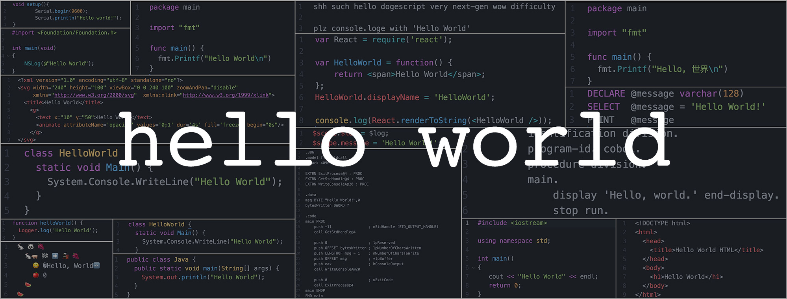

<picture>
    <source media="(prefers-color-scheme: dark)" srcset="header-dark.jpg">
    <source media="(prefers-color-scheme: light)" srcset="header-light.jpg">
    
</picture>

**I'm Johnathan** 👋 - The sense of accomplishment I derive from software development is unparalleled. There's a unique satisfaction in seeing source code come together to form a functioning piece of software. It's a feeling of creative expression and problem-solving that I haven’t been able to find anywhere else. Recently, I’ve found great interest in the design and implementation of programming languages themselves, and have directed my academic studies towards type theory and compilers. I’ve also begun building my own programming language, Arc, in both C++, and Rust.

I have more than 4 years of experience defining requirements, and designing, implementing, testing and delivering complex web applications using a variety of programming languages and technologies. I am also a certified Scrum Master, Product Owner, and Developer, and an M.B.A graduate, and am able to effectively introduce Scrum to teams and organizations, as well as contribute to existing teams. More recently, this has been in .NET/React based environments deployed across both AWS and Azure, but I have also spent significant time with Java/Spring, Angular, and Vue, and on-premises environments.

<a href="https://github.com/Andrew6rant/Andrew6rant">
  <picture>
    <source media="(prefers-color-scheme: dark)" srcset="https://raw.githubusercontent.com/Andrew6rant/Andrew6rant/main/dark_mode.svg">
    
  </picture>
</a>

<picture>
    <source media="(prefers-color-scheme: dark)" srcset="./profile-3d-contrib/profile-night-rainbow.svg">
    <source media="(prefers-color-scheme: light)" srcset="./profile-3d-contrib/profile-green-animate.svg">
    
</picture>
